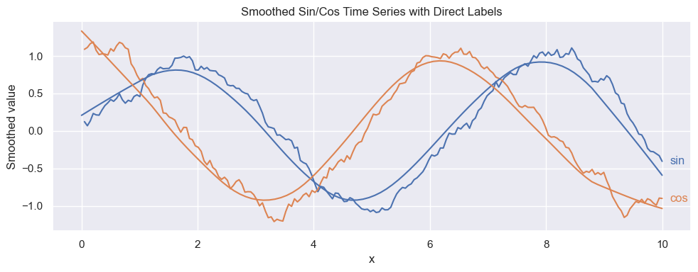

# Seaborn Objects Recipes

[](https://pypi.org/project/seaborn_objects_recipes/)

[](https://github.com/oosei25/seaborn_objects_recipes/actions)
[](https://oosei25.github.io/seaborn_objects_recipes/)

## 📘 About

seaborn_objects_recipes is a Python package that extends the functionality of the Seaborn library, providing custom recipes for enhanced data visualization. This package includes below features to augment your Seaborn plots with additional capabilities.

- [Rolling](https://github.com/Ofosu-Osei/seaborn_objects_recipes/blob/main/seaborn_objects_recipes/recipes/rolling.py)
- [LineLabel](https://github.com/Ofosu-Osei/seaborn_objects_recipes/blob/main/seaborn_objects_recipes/recipes/line_label.py)
- [Lowess](https://github.com/Ofosu-Osei/seaborn_objects_recipes/blob/main/seaborn_objects_recipes/recipes/lowess.py)
- [PolyFitWithCI](https://github.com/Ofosu-Osei/seaborn_objects_recipes/blob/main/seaborn_objects_recipes/recipes/plotting.py)

> For the full gallery and API, see the docs: [API-Gallery Docs](https://oosei25.github.io/seaborn_objects_recipes/)

## 📊 Combined Example: Rolling + LOWESS + Direct Line Labels

This example shows how multiple recipes can be layered to clarify noisy time-series data. We generate two synthetic series (sin and cos), apply a short-window rolling mean to smooth local fluctuations, overlay a LOWESS curve to reveal the long-term structure, and add LineLabel to place direct text labels at the right edge of each line.

This pattern is useful when you want:

• Local smoothing (Rolling) to reduce short-term noise

• Nonparametric smoothing (Lowess) to reveal global trends

• Direct labeling (LineLabel) to avoid legends and improve readability in multi-series plots

> Together, these transforms produce a clean, interpretable visualization that emphasizes both local variation and overall structure — ideal for exploratory time-series analysis, sensor measurements, economic indicators, or any repeated noisy signal.

```python
    import seaborn.objects as so
    import seaborn_objects_recipes as sor
    import seaborn as sns
    import numpy as np
    import pandas as pd

    # ---- Example data ----
    np.random.seed(42)
    x = np.linspace(0, 10, 200)
    y1 = np.sin(x) + np.random.normal(scale=0.25, size=len(x))
    y2 = np.cos(x) + np.random.normal(scale=0.25, size=len(x))

    df = pd.DataFrame(
        {
            "x": np.tile(x, 2),
            "y": np.concatenate([y1, y2]),
            "series": np.repeat(["sin", "cos"], len(x)),
        }
    )

    (
        so.Plot(df, x="x", y="y", color="series", text="series")
        # Rolling-smoothed line
        .add(so.Line(), rolling := sor.Rolling(window=8, agg="mean"),legend=False,)
        # LOWESS-smoothed line (overlaid)
        .add(so.Line(), sor.Lowess(frac=0.25),legend=False,)
        # Direct labels at the right edge of each series
        .add(sor.LineLabel(offset=8), rolling)
        .layout(size=(10, 4))
        .label(
            title="Smoothed Sin/Cos Time Series with Direct Labels",
            x="x",
            y="Smoothed value",
        )
        .show()
    )
```



## ⚙️ Installation

To install `seaborn_objects_recipes`, run the following command:

```python
pip install seaborn_objects_recipes

```

## ✉️ Contact

For questions or feedback regarding `seaborn_objects_recipes`, please contact [Ofosu Osei](mailto:goofosuosei@gmail.com).

## 🌟 Credits

* Special thanks to [@nickeubank](https://github.com/nickeubank) for the support and mentorship on this project

* Special thanks to [@JesseFarebro](https://github.com/JesseFarebro) for [Rolling, LineLabel](https://github.com/mwaskom/seaborn/discussions/3133)

* Special thanks to [@tbpassin](https://github.com/tbpassin) and [@kcarnold](https://github.com/kcarnold) for [LOWESS Smoother](https://github.com/mwaskom/seaborn/issues/3320)

## 🤝 Contributing

Contributions are welcome! Please feel free to submit a Pull Request.

> Quick Checklist:

• ✅ Distinct x-value count valid for LOWESS (frac ≥ 2/n)

• ✅ CI columns present (ymin, ymax) when bootstrapping is on

• ✅ alpha respected and bootstraps defaulted if unset
